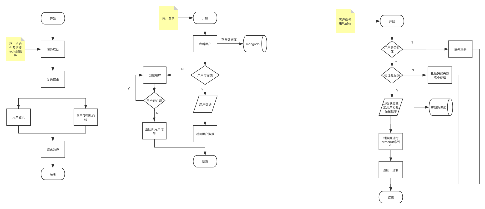
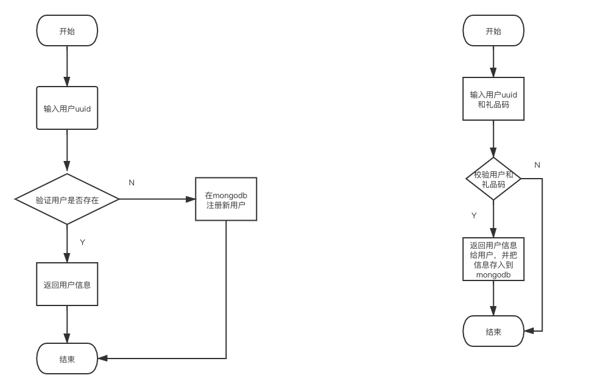

# Go技术文档大纲-礼品码

## 1.整体框架

（1）【客户端调用, http】新增注册与登录接口：客户端传递唯一识别码（一个任意字符串）至服务器，服务器通过该识别码判断是否存在该玩家：不存在则注册新用户，生成唯一UID；存在则返回用户登陆数据（唯一UID、金币数、钻石数）。玩家信息储存在mongo数据库中

（2）【客户端调用, http】验证礼品码接口修改：按照管理员所添加的金币与钻石奖励数目，发放奖励存储至数据库。编译protobuf文件，将返回信息封装为protobuf对象以 **[]byte** 作为接口返回值返回给客户端。客户端接收到的是二进制序列，可以编写单测函数通过protobuf的decode方法解析，自测内容正确性。

## 2.目录结构

```
.
├── Protobuf
│   ├── clientresult.pb.go
│   └── clientresult.proto
├── Readme.md
├── config
│   ├── mongodb.go
│   └── redis.go
├── controller
│   ├── StatusErr.go #状态码
│   └── controller.go
├── gift4.png
├── go.mod
├── go.sum
├── http
│   ├── main
│   └── main.go
├── model
│   ├── Dboperation
│   │   └── dbopreation.go
│   └── model.go
├── router
│   └── router.go
├── service
│   ├── rand.go
│   ├── service.go
│   ├── service_test.go
│   └── userinfo.go
└── test
    ├── __pycache__
    │   └── locust_test.cpython-39.pyc
    ├── giftcode4_locust.html
    └── locust_test.py


```


## 3.代码逻辑分层

​	

| 层        | 文件夹                                | 主要职责                     | 调用关系                         | 其他说明     |
| --------- | ------------------------------------- | ---------------------------- | -------------------------------- | ------------ |
| 应用层    | /http/main.go                         | 程序启动                     | 调用控制层，和redis层            |              |
| config层  | /config/redis.go , /config/mongodb.go | 初始化连接redis ,mongodb     | 被服务层和应用层调用,model层调用 |              |
| 控制层    | /controller                           | 处理请求和构建回复消息       | 被路由调用，调用服务层           |              |
| service层 | /service/                             | 业务逻辑实现                 | 被控制层调用                     | 各层互不调用 |
| model层   | /model                                | 数据模型 ，操作mongodb数据库 | 被服务层所调用                   | 各层互不调用 |
| 路由层    | /router                               | 路由初始化                   | 被应用层调用，调用控制层         |              |


## 4.存储设计

数据库存储信息

| 内容   | 数据库  | filed   | 类型   | 说明           |
| ------ | ------- | ------- | ------ | -------------- |
| 用户id | mongodb | uid     | string | uid：userid    |
| 金币数 | mongodb | gold    | string | gold：“40”     |
| 钻石数 | mongodb | diamond | string | diamond：“100” |

```
UerInfo保存用户数据信息
```

| 内容   | field   | 类型   |
| ------ | ------- | ------ |
| 用户id | UID     | string |
| 金币   | Gold    | string |
| 钻石   | Diamond | string |

## 5.接口设计

### 1.用户登录

### 	请求方式

​		http get

### 	接口地址

​		http://localhost:8080/login?userid=HrKcLApw

### 	请求参数

```json
userid=HrKcLApw
```

### 请求响应

```json
{
    "Code": 202,
    "Message": "已为用户注册",
    "Data": {
        "UID": "lBzgbaiC",
        "Gold": "0",
        "Diamond": "0"
    }
}
```

### 	响应状态吗	

| 状态码 | 说明                         |
| ------ | ---------------------------- |
| 200    | 用户登录成功                 |
| 202    | 用户不存在，已为用户主动注册 |
| 507    | 数据未能插入数据库           |
| 414    | 请输入用户id                 |

### 2.用户使用礼品码

### 	请求方式

​		http post

### 	接口地址

http://localhost:8080/Client_Verify_GiftCode

### 	请求参数

```json
{
  "user": "HrKcLApw",
  "code": "1ZAZB42T"
}
```

### 请求响应

```json
protobuf二进制数
```

### 	响应状态吗	

| 状态码 | 说明               |
| ------ | ------------------ |
| 200    | 成功               |
| 400    | 绑定参数未成功     |
| 411    | 礼品码为空         |
| 401    | 请输入用户id       |
| 412    | 领取失败           |
| 508    | 解析成protobuf失败 |

### 

## 6.第三方库

```
github.com/go-redis/redis v6.15.9+incompatible 礼品码信息的保存

```

## 7.如何编译执行

### 代码格式化

```
make fmt
```

### 代码静态检测

```
make vet
```

### 执行可执行文件

```
./main
```

详细步骤



整体逻辑思想


